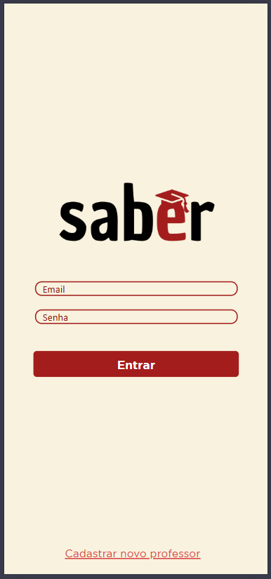
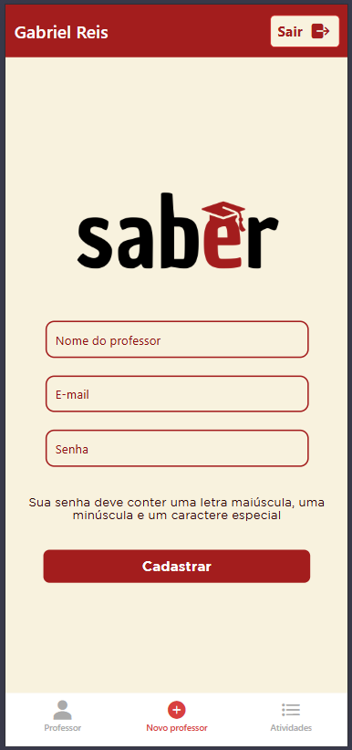
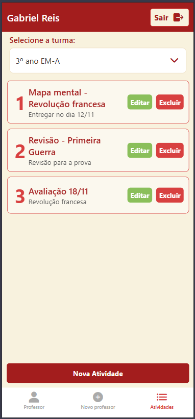
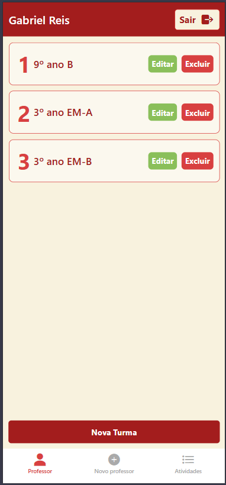

# APP - Gerenciamento de uma escola

Gabriel Reis e Isadora Gomes

### Expo e base React Native
npm install expo react react-dom react-native

### Navegação
npm install @react-navigation/native
npm install @react-navigation/bottom-tabs
npm install @react-navigation/native-stack

### Dependências extras da navegação
npx expo install react-native-screens react-native-safe-area-context

### Supabase (autenticação e banco de dados)
npm install @supabase/supabase-js

### Interface e ícones
npm install react-native-paper
npm install react-native-vector-icons

### Gestos e modais
npm install react-native-gesture-handler
npm install react-native-modal

### Barra de status (Expo)
npm install expo-status-bar

Depois de instalar, para executar: 

npx expo start

    
    
    
    

